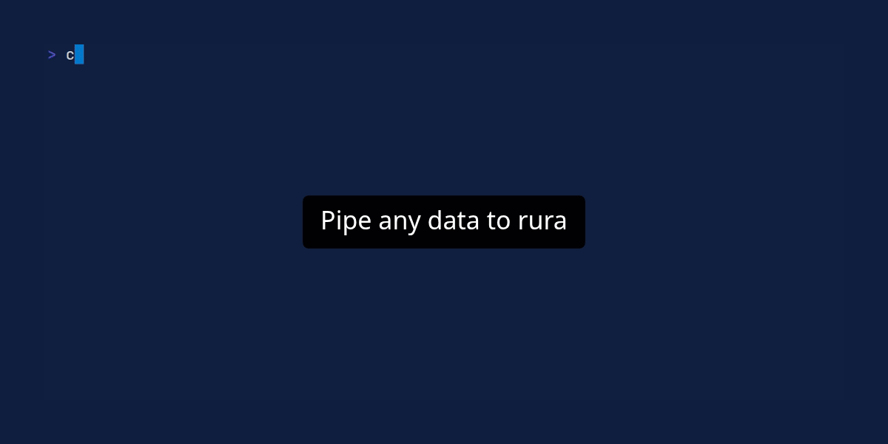

# Rura

Rura is an interactive TUI pipeline editor built for rapid iteration. It keeps your cursor in place and executes
commands – either in full or only up to your current position – eliminating the need to navigate shell history to refine
your logic.



## Usage

You can start Rura by passing a file as an argument or by piping data into it.

```bash
# Open a file
rura data.json

# Pipe data into rura
cat logs.txt | rura
```

Once Rura is open, you can start typing your shell commands in the input field at the top. Press **Enter** to execute
the pipeline and see the results in the main area below.

## Key Bindings

### Command Execution

* **Enter**: Execute the full command pipeline.
* **Alt + \\**: Execute the pipeline up to the current subcommand (where your cursor is).
* **Alt + Shift + \\**: Execute the pipeline up to the *previous* subcommand.
* **Alt + i**: Reset view to show the original input data.

### Navigation & View

* **Arrows** or **Alt + h/j/k/l**: Scroll the output (Left, Down, Up, Right).
* **PageUp / PageDown**: Scroll the output by page.
* **Ctrl + u / Ctrl + d**: Scroll up or down quickly.
* **Alt + w**: Toggle line wrapping.

### History

* **Ctrl + p**: Previous command in history.
* **Ctrl + n**: Next command in history.

### General

* **Ctrl + c**: Exit Rura. When you exit, the last executed command is printed to your terminal.
